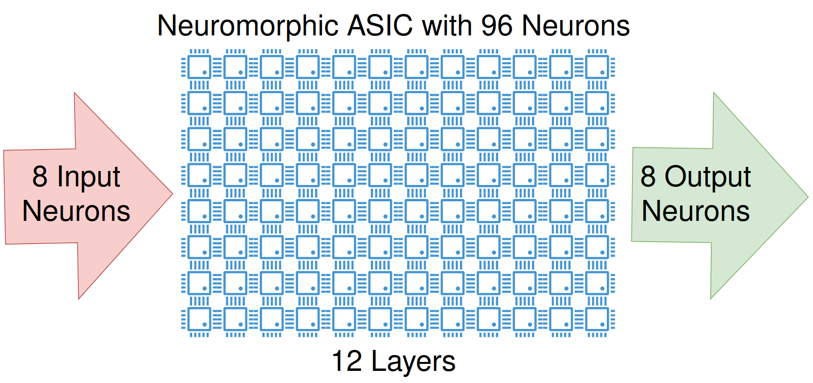
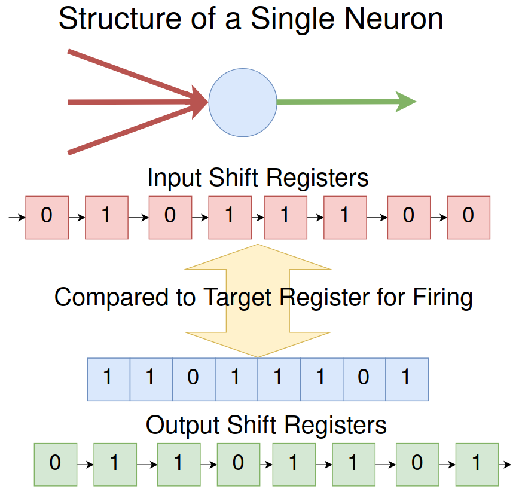

<!---

This file is used to generate your project datasheet. Please fill in the information below and delete any unused
sections.

You can also include images in this folder and reference them in the markdown. Each image must be less than
512 kb in size, and the combined size of all images must be less than 1 MB.
-->

## How it works

Neuronmorphic ASIC with 96 neurons arranged in an 8 neuron by 12 layer grid.
* All 96 Neurons are fully programmable
* There are 8 serial inputs to the neural network directly connected to uio_in[0], uio_in[1], ..., uio_in[7]
* There are 8 serial outputs of the neural network directly connected to uo_out[0], uo_out[1], ..., uo_out[7]
* The Neural network is controlled by ui_in[0], ui_in[1], ..., ui_in[7]
* Over 300 Neural connections in the neural network
* 18470 total cells with 59.09% utilization in TinyTapeout 7 

| Pin Name       | Type         | Connection                           |
|----------------|--------------|--------------------------------------|
| ui[0]/ui_in[0] | Serial Input | Directly connected to input neuron 0 |
| ui[1]/ui_in[1] | Serial Input | Directly connected to input neuron 1 |
| ui[2]/ui_in[2] | Serial Input | Directly connected to input neuron 2 |
| ui[3]/ui_in[3] | Serial Input | Directly connected to input neuron 3 |
| ui[4]/ui_in[4] | Serial Input | Directly connected to input neuron 4 |
| ui[5]/ui_in[5] | Serial Input | Directly connected to input neuron 5 |
| ui[6]/ui_in[6] | Serial Input | Directly connected to input neuron 6 |
| ui[7]/ui_in[7] | Serial Input | Directly connected to input neuron 7 |

* ui[0]/ui_in[0] to ui[7]/ui_in[7] are directly connected to neuron 0 to neuron 7
* Each individual input pin store 8 bits of serial data
* Clocked on rising edge CLK

| Pin Name        | Type          | Connection                      |
|-----------------|---------------|---------------------------------|
| uo[0]/uo_out[0] | Serial Output | Directly connected to neuron 88 |
| uo[1]/uo_out[1] | Serial Output | Directly connected to neuron 89 |
| uo[2]/uo_out[2] | Serial Output | Directly connected to neuron 90 |
| uo[3]/uo_out[3] | Serial Output | Directly connected to neuron 91 |
| uo[4]/uo_out[4] | Serial Output | Directly connected to neuron 92 |
| uo[5]/uo_out[5] | Serial Output | Directly connected to neuron 93 |
| uo[6]/uo_out[6] | Serial Output | Directly connected to neuron 94 |
| uo[7]/uo_out[7] | Serial Output | Directly connected to neuron 95 |

* uo[0]/uo_out[0] to uo[7]/uo_out[7] are directly connected to neuron 88 to neuron 95
* Each individual output pin produces 8 bits of serial data
* Clocked on rising edge CLK

| Pin Name         | Type               | Description                                                     |
|------------------|--------------------|-----------------------------------------------------------------|
| CLK              | Input Clock        | Rising Edge Clock                                               |
| RST_N            | Input Reset        | Set High to program a selected neuron. Low does nothing.        |
| uio[0]/uio_in[0] | Input Program Data | Data for 1-wire serial protocol for programming selected neuron |
| uio[1]/uio_in[1] | Input Address      | Address[0] used to select a single neuron for programming       |
| uio[2]/uio_in[2] | Input Address      | Address[1] used to select a single neuron for programming       |
| uio[3]/uio_in[3] | Input Address      | Address[2] used to select a single neuron for programming       |
| uio[4]/uio_in[4] | Input Address      | Address[3] used to select a single neuron for programming       |
| uio[5]/uio_in[5] | Input Address      | Address[4] used to select a single neuron for programming       |
| uio[6]/uio_in[6] | Input Address      | Address[5] used to select a single neuron for programming       |
| uio[7]/uio_in[7] | Input Address      | Address[6] used to select a single neuron for programming       |

* uio[1]/uio_in[1] to uio[7]/uio_in[7] are used to select a single neuron from the 96 neuron array
* If RST_N is low, then nothing happens. If RST_N is high, then the selected individual neuron enters a programming stage.
* 16 bit serial input to uio[0]/uio_in[0] writes information to the internal registers of the selected neuron
* Clocked on rising edge CLK

* Each neuron has multiple inputs written to an 8 bit input shift register
* If the input shift register matches the 8 bit internal target register then the neuron fires
* Upon firing, the 8 bit output shift register output a predetermined sequence to the next neuron or output of the network

## How to test

Program the neurons and input random sequence to the neural network

## External hardware

None
